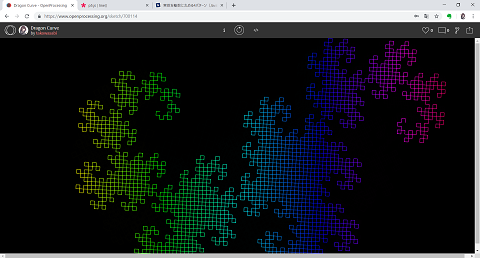
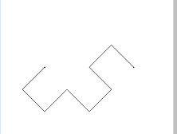
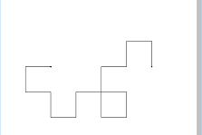
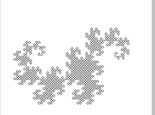
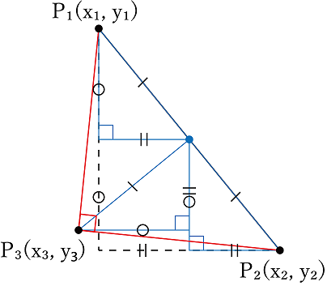
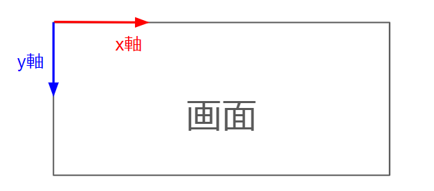
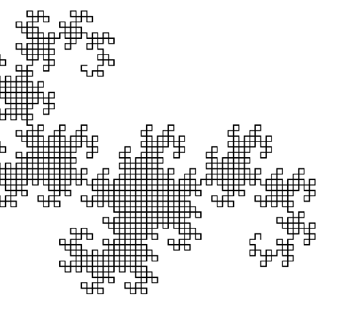

OpenProcessing体験講座 ver.2
==

この記事は、2019/4/19開催のOpenProcessing体験講座のための資料です。

## 今回の作品



今回は、単純な法則から作られる複雑な図形である、ドラゴン曲線と呼ばれる図形を描くプログラムを書いていきます。

その名の通り（？）ドラゴンを彷彿とさせる複雑な模様のように見えますが、プログラムで書くのはとても簡単です。

## ここがポイント

- ドラゴン曲線のルール
- 関数
- 再帰関数呼び出し

## ドラゴン曲線のルール

ドラゴン曲線は、以下のようにしていくと描くことが出来ます。

1．まずは2点の点の座標を受け取ります


2．受け取った二つの点を結ぶ線分を引きます


3．2.で引いた線分を90°に折るようにして、直交する二つの線分に置き換えます


4．3.で引いた二つの線分に対して、2.のように直交する二つの線分への置き換えを行います


5．3.、4.と同じように線分の置き換えを行っていきます



6．3.、4.、5.と同じように線分の置き換えを行っていくと、だんだんと複雑な形になっていきます



7．3.、4.と同じような操作を10回繰り返すと、以下のように非常に複雑な図形が浮かび上がります



8．n回同じ操作を繰り返し、目的の図形が得られれば終了です

このとき、線分を置き換えるときに、もともとの線分をP1(x1, y1)とP2(x2, y2)を結ぶものとし、線分が直交する点をP3(x3, y3)とすると、以下の関係が常に成り立ちます。


この関係は、以下のような図をイメージすると分かりやすいと思います。



与えられた２点を含み、X軸とY軸に平行な2辺を含む直角三角形を考えて、それに相似でそれぞれの辺が1/2になるような三角形（青色で描いてあるやつ）を図のように置いていくと、P3(x3, y3)を見つけることが出来ます。

青い三角形の辺の長さが(x2-x1)/2（｜｜の辺）、-(y2-y1)/2（〇の辺）であることから、上の数式の関係が成り立ちます。

## プログラミングで実装

簡単に数式を知ってもらったところで、今度はプログラムの話です。

OpenProcessingのホーム画面から、「Create a Sketch」で新しいスケッチを作成してください。

スケッチブックを作成したときに、画面に書かれている文字列が、いわゆるプログラムです。

始めは、以下のようにプログラムが書かれているはずです。

```js
function setup() {
    createCanvas(windowWidth, windowHeight);
    background(100);
}

function draw() {
    ellipse(mouseX, mouseY, 20, 20);
}
```

少しだけ書き換えて、`background`の後の丸括弧の中身を`255`にしておきましょう。（背景が灰色で見づらくなってしまうため）

```js
function setup() {
    createCanvas(windowWidth, windowHeight);
    background(255);
}

function draw() {
    ellipse(mouseX, mouseY, 20, 20);
}
```

それでは、ここからプログラムの基本事項を説明しながらドラゴン曲線を目指していきます。

### 線分の描き方

ドラゴン曲線は結局のところ、線分から出来ています。まずは、OpenProcessingの線分の描き方を知りましょう。

二点の座標があれば、それらを結ぶ線分を、以下のようなプログラムで描画することが出来ます。

```
line(「P1のX座標」, 「P1のY座標」, 「P2のX座標」, 「P2のY座標」);
```

上記のものは偽物のコードなので動きませんが、lineの後に丸括弧をつけて、カンマ区切りで座標の数字を入れていけば、2点を結ぶ線分を描くことが出来ます。

試しに、OpenProcessingのコードを以下のように書き換えてみてください。

```js
function setup() {
    createCanvas(windowWidth, windowHeight);
    background(100);
}

function draw() {
    line(100, 100, 300, 300);
}
```

変わったのは`line(100, 100, 300, 300);`の部分だけです。

この状態で画面上部の「▶」ボタンを押して実行してみましょう。

画面に黒い線が表示されるはずです。（表示されない場合はコードを見直してみてください）

ここで、座標と線が対応していないようにも思えますが、OpenProcessingの座標系は下図のようになっているので、ご注意ください。



確認が出来たら、画面上部の「</>」ボタンを押してプログラムの編集画面に戻ってください。

### 変数

ドラゴン曲線には、最初に与えられる2点の座標が必要です。それぞれの点をP1(x1, y1)、P2(x2, y2)とします。

ここでは、座標を扱う際に、**変数**という概念を用います。

- 座標を表す数値は、一度だけでなく複数回使う可能性があります
- 座標を表す数値をプログラムに書き込むときに、それが座標であることを明記しておくと、プログラム読むのが楽になります

これらの理由から、座標を表す数値をラベル付きの入れ物に入れておいて、使いまわすことが出来ると便利です。

そこで使われるのが**変数**です。

変数は、以下のように書くことで作ることが出来ます。

```js
let x1 = 100;
```

こう書くことで、x1というラベルの付いた入れ物に、とりあえず0を入れておいてね、という意味になります。

`let`は、変数を作るときに書くべきものと思っておけば大丈夫です。

ということで、さっそくP1(x1, y1)とP2(x2, y2)の座標を変数で用意しましょう。

```js
function setup() {
    createCanvas(windowWidth, windowHeight);
    background(255);
}

function draw() {
    let x1 = 100;
    let y1 = 100;
    let x2 = 300;
    let y2 = 300;
	
    line(x1 ,y1, x2, y2);
}
```

`x1`以外にも、`y1`、`x2`、`y2`という変数を用意しました。

`line(x1 ,y1, x2, y2);`に注目してください。実際に数字は書かれていませんが、「▶」ボタンで実行してみると、先ほどと同じ線分が描かれるはずです。

### 数式の実装

ドラゴン曲線を目指して、まずはP1(x1, y1)とP2(x2, y2)を用いて、線分を分割するためのP3(x3, y3)を求めていきましょう。

P3の成分x3とy3を求める数式は以下のようなものでした。


これをプログラムに置き換えると、以下のようになります。

```js
let x3 = x1 + ((x2 - x1) - (y2 - y1)) / 2;
let y3 = y2 + ((x2 - x1) - (y2 - y1)) / 2;
```

この文では、計算の結果を`x3`と`y3`という新しい変数に入れています。

計算の記述方法は、ほとんど数式そのままです。

プログラムはもともと計算を行うために作られたものなので、このように数式を立てておくと、とても書くのが楽になります。

それでは、このように計算できるP3(x3, y3)とP1(x1, y1)、P2(x2, y2)を結ぶ線分を描くプログラムを書いてみましょう。

```js
function setup() {
    createCanvas(windowWidth, windowHeight);
    background(255);
}

function draw() {
    let x1 = 100;
    let y1 = 100;
    let x2 = 300;
    let y2 = 300;
	
    let x3 = x1 + ((x2 - x1) - (y2 - y1)) / 2;
    let y3 = y2 + ((x2 - x1) - (y2 - y1)) / 2;
	
    line(x3 ,y3, x1, y1);
    line(x3 ,y3, x2, y2);
}
```

今回は二つの線分を描くので、線分を描くプログラムが`line(x3 ,y3, x1, y1);`と`line(x3 ,y3, x2, y2);`の二行になります。

実際に実行してみると、斜めに描かれていた線分が、90°に折れて二つの線分になっているはずです。

### 関数

ドラゴン曲線のルールは、二つの点の座標という**入力**を受け取って、それに伴って**一定の動作**をするというものとなっています。

このように、入力があり、入力を用いて一定の処理をするプログラムは、**関数**という単位で分割することができます。

関数は以下のように書くことで作成できます。

```js
function drawLineFromOrigin(x, y) {
    line(0, 0, x, y);
}
```

`let`と同じように、`function`というキーワードをつけることで、関数を作ります。そして、関数の名前は`function`の後の、`drawLineFromOrigin`になります。

先ほど説明したように、関数には入力があります。この関数の入力はどの部分に書かれているかというと、`(x, y)`の部分です。関数が使われるときに、入力された値を、変数に入れるのと同じように`x`と`y`に入れてくれます。

入力を示す`(x, y)`の後は`{}`の括弧が配置されます。この括弧の中に書かれているプログラムが、関数によって分割されたプログラムです。

入力された値を表す`x`と`y`の値を、線分を描くための`line(0, 0, x, y);`に書いておくことで、関数に渡された値を用いて線分を描くことが出来ます。

その名の通り例に出したこの関数は、原点(0, 0)から、入力された点(x, y)までの線分を引く役割を持ったプログラムの断片なのです。

もし、この関数を呼び出すとしたら、そのプログラムは以下のようになります。

```js
drawLineFromOrigin(100, 100);
```

このように記述することで、原点(0, 0)から入力(100, 100)までの線分を描くことができます。

ここで、皆さんこの形に何か覚えがないでしょうか？

実は、今まで登場していた`line()`も、もともと用意された関数の一つなのです。

また、OpenProcessingでもともと用意されていた、`draw()`や`setup()`も関数の一つです。

プログラムの多くは、関数として分割され、そしてそれらを呼び出すことで処理を進めていくのです。

さて、本題のドラゴン曲線の方に戻りますが、今回はドラゴン曲線を描く部分を、二つの点を入力する関数として書いていきます。

まずは、コードを以下のように書き換えてください。

```js
function setup() {
    createCanvas(windowWidth, windowHeight);
    background(255);
}

function draw() {
    let x1 = 100;
    let y1 = 100;
    let x2 = 300;
    let y2 = 300;
	
    dragonCurve(x1, y1, x2, y2);
}

function dragonCurve(x1, y1, x2, y2) {
    let x3 = x1 + ((x2 - x1) - (y2 - y1)) / 2;
    let y3 = y2 + ((x2 - x1) - (y2 - y1)) / 2;
	
    line(x1, y1, x3 ,y3);
    line(x2, y2, x3 ,y3);
}
```

上記のように書いても、「▶」で実行してみると、結果は同じになります。

関数とは、プログラムの挙動を変えるものではありませんが、プログラムを分割することで、分かりやすくなり、細かい部品として使い回すことが出来るようにします。

### 再帰関数

さて、ドラゴン曲線の第一歩として、入力の2点を結んだ線分を折ることは出来ました。

しかし、ここからドラゴン曲線を描くためには、今の線分をさらに折っていく作業が必要になります。

そのために、今回は関数のさらなる力が発揮される**再帰**を用いていきます。

再帰が何かというのは簡単な話で、関数の中から、今処理している関数と**同じ関数**を呼ぶことを再帰関数呼び出しと呼びます。

現在、ドラゴン曲線を描くための関数`dragonCurve()`は、入力の二点を結ぶ直線を90°に折る機能を持っています。

そこで、90°に折ったあとの二つの点同士の組を入力として、さらに`dragonCurve()`を呼び出すようにします。

この仕組みによって、ドラゴン曲線を描くために繰り返される処理を、一つの関数で行うことが出来るようにします。

素直にコードを書くならば、以下のようになるでしょう。

※このコードは間違っているので、実行しないようにして下さい！

```js
function setup() {
    createCanvas(windowWidth, windowHeight);
    background(255);
}

function draw() {
    let x1 = 100;
    let y1 = 100;
    let x2 = 300;
    let y2 = 300;
	
    dragonCurve(x1, y1, x2, y2);
}

function dragonCurve(x1, y1, x2, y2) {
    let x3 = x1 + ((x2 - x1) - (y2 - y1)) / 2;
    let y3 = y2 + ((x2 - x1) - (y2 - y1)) / 2;
	
    line(x1, y1, x3 ,y3);
    line(x2, y2, x3 ,y3);
	
    dragonCurve(x1, y1, x3 ,y3);
    dragonCurve(x2, y2, x3 ,y3);
}
```

`dragonCurve(x1, y1, x3 ,y3);`と`dragonCurve(x2, y2, x3 ,y3);`の二行を追加しました。見ての通り、関数`dragonCurve()`の中から、`dragonCurve()`を呼び出しています。

この関数を実行すると、皆さんもよくご存じの無限ループにはまります。

`dragonCurve()`が`dragonCurve()`を呼び、呼び出された`dragonCurve()`がまた`dragonCurve()`を呼ぶという恐ろしいループが始まってしまうので、再帰関数を作る場合には、本当にその関数の呼び出しが終わるのかを確かめる必要があります。

今回は、再帰関数呼び出しに回数制限を付与して、無限ループを防ぐことにしたいと思います。

### if-else文

再帰関数呼び出しに回数制限をつけるためには、後なんかい呼び出すかのカウンタを用意して、それを呼び出すたびに減らしていくのがよいでしょう。

先ほどのコードを以下のように書き換えることで、関数を呼び出せる回数のカウンタを伝えていくことが出来ます。

※これまたコードが間違っているので、実行しないようにして下さい！

```js
function setup() {
    createCanvas(windowWidth, windowHeight);
    background(255);
}

function draw() {
    let x1 = 100;
    let y1 = 100;
    let x2 = 300;
    let y2 = 300;
	
    dragonCurve(x1, y1, x2, y2, 10);
}

function dragonCurve(x1, y1, x2, y2, n) {
    let x3 = x1 + ((x2 - x1) - (y2 - y1)) / 2;
    let y3 = y2 + ((x2 - x1) - (y2 - y1)) / 2;
	
    line(x1, y1, x3 ,y3);
    line(x2, y2, x3 ,y3);
	
    dragonCurve(x1, y1, x3 ,y3, n - 1);
    dragonCurve(x2, y2, x3 ,y3, n - 1);
}
```

書き換えたのは

- `dragonCurve(x1, y1, x2, y2, 10);`
- `function dragonCurve(x1, y1, x2, y2, n) {`
- `dragonCurve(x1, y1, x3 ,y3, n - 1);`
- `dragonCurve(x2, y2, x3 ,y3, n - 1);`

の4行です。

カウンタとして、`n`という変数を導入しています。

関数の入力として`n`を受け取り、その値から1を引いた値を再帰関数呼び出しのときに渡すことで、`dragonCurve()`が呼び出されるたびに、後何回呼び出すことが出来るのかを知ることが出来ます。

関数`draw()`内の、最初の`dragonCurve()`の呼び出しの時には、再帰関数呼び出しの回数として`10`を入力に渡しています。

しかし、これだけではまだ足りません。

後何回呼び出すことが出来るのかを知っていても、カウンタの値が0以下になったときに、再帰関数呼び出しを行わないように、処理を分岐させる必要があります。

そこで用いるのが**if-else文**です

if-else文は、英単語のニュアンスからも分かる通り、「もし～なら、～する、でもそうじゃないなら～する」というような処理をプログラムすることが出来ます。

簡単な具体例を見てみましょう。

```js
let x = 100;
if (x <= 100) {
    line(0, 0, 100, 100);
}
else {
    line(100, 100, 1000, 1000);
}
```

このように書くことで、

```
もしxが100以下なら
    (0, 0)から(100, 100)までの線分を引く
そうでないなら
    (100, 100)から(1000, 1000)までの線分を引く
```

というような処理をするプログラムを書くことが出来ます。

細かく説明していくと、`if`というキーワードに続く`()`の中に、分岐するための条件を書きます。

今回は`x`が100以下かどうかを調べたいので、数学での≦のプログラムバージョンである`<=`という記号を使って条件を表しています。

`()`の中の条件が成り立つとき、その後に書かれている`{}`の中に書かれた処理が行われます。

逆に、`()`の中の条件が成り立たないときには、`else`の後に続く`{}`の中に書かれた処理を行うようになっています。

では、ドラゴン曲線に話を戻します。

このif-else文を用いて、カウンタの値が0以下になったときに、再帰関数呼び出しを行わないように、処理を分岐させます。

実際にif-else文を書き加えたものがこちらです。

```js
function setup() {
    createCanvas(windowWidth, windowHeight);
    background(255);
}

function draw() {
    let x1 = 100;
    let y1 = 100;
    let x2 = 300;
    let y2 = 300;
	
    dragonCurve(x1, y1, x2, y2, 10);
}

function dragonCurve(x1, y1, x2, y2, n) {
    let x3 = x1 + ((x2 - x1) - (y2 - y1)) / 2;
    let y3 = y2 + ((x2 - x1) - (y2 - y1)) / 2;
	
    if (n <= 0) {
        line(x1, y1, x3 ,y3);
        line(x2, y2, x3 ,y3);
    }
    else {
        dragonCurve(x1, y1, x3 ,y3, n - 1);
        dragonCurve(x2, y2, x3 ,y3, n - 1);
    }
}
```

書き加えたのは

- `if (n <= 0) {`
- `}`
- `else {`
- `}`

のみです。

このようにif-else文を書き加えて「▶」から実行してみると、（正しいプログラムならば）以下のような複雑怪奇なドラゴン曲線が描かれているはずです。



このif-else文での分岐の意味としては、

- もし、カウンタが0以下ならば入力から計算した二つの線分を描画しなさい
- そうでないならば、新しい2組の点同士でもう一度再帰呼び出しをしなさい

となります。

ドラゴン曲線を描くためには、折っていく過程の線分は描画する必要ないので描画せず、さらに折っていくための再帰関数呼び出しのみを行えばよいため、このようなプログラムを書くことでドラゴン曲線を描くことができます！やりました！

## まとめ

今回のOpenProcessing講座の要点は以下の通りです。

- あらかじめルールや数式を決めておけば、プログラムは書きやすい、超簡単！
- 関数はプログラミングとは切っても切れない仲、しっかり付き合っていこう！
- 再帰関数呼び出しを使うときは無限ループに注意！if-slse文を使って処理が終わるようにしよう！

今回は、プログラミングでよく取り上げられる**フラクタル**と呼ばれる図形たちの一つであるドラゴン曲線を取り上げました。

このように、細かい単純な処理をたくさん行って、複雑なことをするのはコンピュータの専売特許です。みなさんも、フラクタルやプログラミングに興味が出てきたら、いろいろ調べてみてください！

## おまけ

今回は最初に与える二点は固定でしたが、いろいろ値をいじってみると、以下のようにきれいな作品が作れたりします。みなさんもいろいろ試してみてください！


- [https://www.openprocessing.org/sketch/700114](https://www.openprocessing.org/sketch/700114)


- [https://www.openprocessing.org/sketch/700851](https://www.openprocessing.org/sketch/700851)